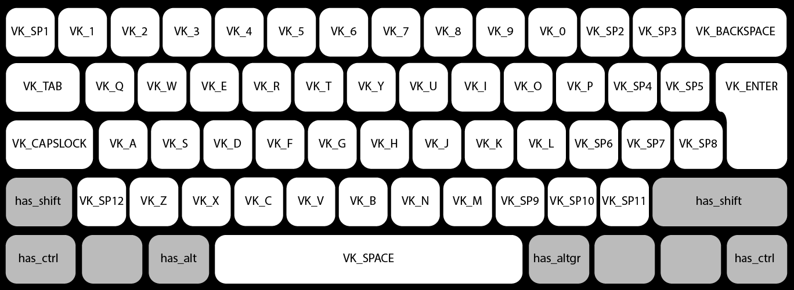

 # Simulating keyboard on Linux, Windows and Mac OS in rust

 On the next example, the library simulates key A, Z pressed.

 **The keyboard layout on the computer is important!**

 If you use a keyboard layout the US, you have corresponding keys, but if you use, for example, the french layout, you have another result.
 ```rust
extern crate keybd_event;

#[cfg(target_os = "linux")]
use std::thread::sleep;
#[cfg(target_os = "linux")]
use std::time::Duration;
use keybd_event::KeyboardKey::{KeyA,KeyZ};
use keybd_event::KeyBondingInstance;

fn main() {
    let mut kb = KeyBondingInstance::new().unwrap();
    #[cfg(target_os = "linux")]
        sleep(Duration::from_secs(2));
    kb.has_shift(true);
    kb.add_keys(KeyA);
    kb.add_keys(KeyZ);
    kb.launching();
}
 ```


 ## Linux

 On Linux this library use **uinput**, but generally the uinput is only for the root user.

 The easy solution is executing on root user or change permission by `chmod`, but it is not good.

 You can follow the next example, for more security.

```bash
sudo groupadd uinput
sudo usermod -a -G uinput my_username
sudo udevadm control --reload-rules
echo "SUBSYSTEM==\"misc\", KERNEL==\"uinput\", GROUP=\"uinput\", MODE=\"0660\"" | sudo tee /etc/udev/rules.d/uinput.rules
echo uinput | sudo tee /etc/modules-load.d/uinput.conf
```

 Another subtlety on Linux, it is important after creating **KeyBondingInstance**, to waiting 2 seconds before running first keyboard actions

 ## Darwin (MAC OS)
 This library depends on the frameworks Apple, I did not find a solution for cross-compilation.